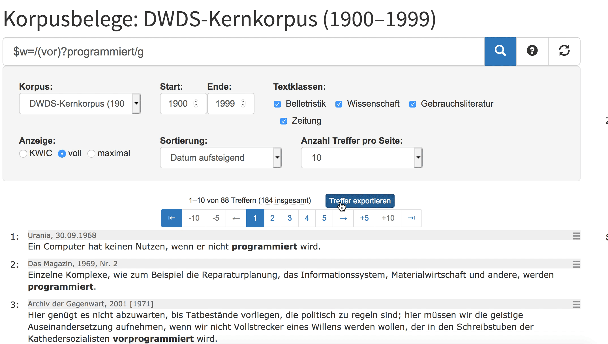

# Von der Fragestellung zur Konkordanz

Die meisten empirischen Studien lassen sich auf folgende Schritte herunterbrechen:

- Eine Fragestellung formulieren
- Daten erheben
- Daten auswerten.


## Eine Fragestellung formulieren

Der erste Schritt ist wahrscheinlich der wichtigste. Nur wenn Sie eine gute Forschungsfrage haben, können Sie eine aussagekräftige empirische Analyse durchführen. Aus der Forschungsfrage ergibt sich die Methode: Für manche Fragestellungen bietet sich z.B. eine Fragebogenstudie an, für eine eine psycho- oder neurolinguistische Herangehensweise, für wieder andere eine Korpusrecherche.

Das heißt auch: Wenn Sie eine Korpusanalyse durchführen möchten, brauchen Sie eine Fragestellung, die korpuslinguistisch operationalisierbar ist. Beispielsweise lässt sich eine Frage wie "Welche Gehirnareale werden beim Hören von Bewegungsverben aktiviert?" natürlich nicht mit Hilfe von Korpusdaten beantworten. 

Für unsere Beispielanalyse werfen wir einen Blick auf die prädikative Verwendung der Partizipien *programmiert* und *vorprogrammiert*. Letzteres ist manchen Sprachpflegern ein Dorn im Auge: So bezeichnet es Batian Sick als

> "umgangssprachliches Blähwort, über das schon Heerscharen von Sprachpflegern hergefallen sind – vergebens, denn es wird immer munter weiter vorprogrammiert. Dabei wissen nicht nur Programmierer: Man programmiert immer im Voraus, die Vorsilbe vor- ist daher pleonastisch, zu Deutsch: doppelt gemoppelt."
`r tufte::quote_footer('--- https://bastiansick.de/kolumnen/abc/vorprogrammiertprogrammiert/')`

Was Sprachpfleger wie Sick jedoch oft verkennen, ist, dass Sprache nicht immer "logisch" ist. Vielmehr suchen sich Wörter oft eigene Nischen. Beispielsweise ist mein Bürostuhl kein *Rollstuhl*, obwohl er Rollen hat - denn das Wort *Rollstuhl* hat eine eigene Bedeutung angenommen, die sich nicht kompositional aus seinen Einzelteilen ergibt. Im Falle von *vorprogrammiert* hingegen passt zwar die Paraphrase 'im Voraus programmiert'. Aber trotzdem wäre denkbar, dass das Wort eine Spezialisierung erfahren hat: Wird *programmiert* möglicherweise eher dann verwendet, wenn ein Programmierungsvorgang im wörtlichen Sinn gemeint ist, und *vorprogrammiert* eher dann, wenn ein z.B. ein Skandal oder eine Katastrophe "vorprogrammiert" sind? Das ist die Fragestellung, der wir im Folgenden nachgehen möchten.


<details>
<summary>‣ **Fragestellungen und Hypothesen**</summary>

Die Unterscheidung von **Fragestellung** und **Hypothese** bereitet Anfänger*innen oft Schwierigkeiten. Beide hängen eng zusammen. In unserem Beispiel könnte man die Frage in eine Hypothese umformulieren: "<i>vorprogrammiert</i> wird eher in metaphorischem und <i>programmiert</i> eher im wörtlichen Sinn verwendet." 

Hypothesen ergeben sich in der Regel aus konkreten Fragestellungen. Beispielsweise könnte in einer soziologischen oder politikwissenschaftlichen Studie die Fragestellung lauten: Welchen Einfluss hat das Alter auf das Wahlverhalten in Deutschland? Da man zu diesem Themengebiet aus der bisherigen Forschung und aus der Alltagserfahrung das eine oder andere schon weiß, kann man begründete Annahmen darüber treffen, wie die Antwort auf diese Frage aussieht. So könnte man davon ausgehen, dass z.B. ältere Menschen eher etablierte und vielleicht auch eher konservative Parteien wählen und dass außerdem bei Älteren eine höhere Wahlbeteiligung vorliegt. Diese Annahmen nennt man Hypothesen. Sie werden auf Grundlage der Daten, die man erhebt, überprüft.

Nicht immer ist es möglich oder notwendig, konkrete Hypothesen zu formulieren. Gerade bei Phänomenen, über die noch sehr wenig bekannt ist, bietet es sich manchmal an, **explorativ**, also "erkundend", zu arbeiten. Auch dann gehe ich mit einer Fragestellung an meine Daten heran, ohne jedoch im Voraus eine Erwartung zu haben, wie die Antwort auf meine Frage aussehen wird.

</details>


## Daten erheben

### Suchsyntax

Für die Datenerhebung verwenden wir das DWDS-Kernkorpus des 20. Jahrhunderts, das über <a href="https://www.dwds.de/" target="_blank">dwds.de</a> zugänglich ist. Wir suchen auf der Wortebene mit Hilfe von regulären Ausdrücken nach den Formen *programmiert* und *vorprogrammiert*. Dafür benutzen wir den Suchstring `@programmiert || @vorprogrammiert`. Das @-Zeichen bedeutet, dass wir genau diese Strings suchen und keine anderen Wortformen wie *programmierte*, *programmiertes* etc. Da uns nur die prädikative Verwendung interessiert, brauchen wir die flektierten Wortformen nicht. Der horizontale Strich \| ist der ODER-Operator; dass man ihn hier doppelt setzen muss, ist eine Besonderheit der DWDS-Suchsyntax.

<details><summary>‣ **Alternative Suchabfrage mit regulären Ausdrücken**</summary>
Alternativ können wir das gleiche Ergebnis auch durch Verwendug regulärer Ausdrücke erzielen: `$w=/(vor)?programmiert/g`. Ich ermutige alle, die sich mit Korpuslinguistik beschäftigen wollen, sehr, sich mit regulären Ausdrücken vertraut zu machen. Allerdings unterstützt die DWDS-Suchsyntax reguläre Ausdrücke derzeit nur in sehr beschränktem Maße. (Deutlich besser ist in dieser Hinsicht das alternative Abfrageportal <a href="https://kaskade.dwds.de/dstar/" target="_blank">Dstar</a>, das jedoch für Anfänger*innen nur bedingt geeignet ist.)</details>


<details>
<summary>‣ **Zur Suche im DWDS und anderswo**</summary>
- Die Hilfe zur Suche im DWDS findet sich <a href="https://www.dwds.de/d/suche" target="_blank">hier</a>.

- Einen Einstieg in reguläre Ausdrücke bietet z.B. <a href="https://www.regular-expressions.info/" target="_blank">regular-expressions.info</a>.

- In den <a href="https://hartmast.github.io/sprachgeschichte/" target="_blank">Begleitmaterialien</a> zu meiner "Deutschen Sprachgeschichte" finden sich ebenfalls einige Tutorials zur Suche in einschlägigen Korpora.

- Sehr empfehlenswert und erfreulich ausführlich ist außerdem die <a href="https://www.bubenhofer.com/korpuslinguistik/kurs/index.php?id=uebersicht.html" target="_blank">Korpuslinguistik-Seite von Noah Bubenhofer.</a>
</details>


### Export

Die Suche liefert uns 88 Treffer, die nun im Browser in ihrem jeweiligen Kontext dargestellt werden. Diese Daten wollen wir nun exportieren, und zwar im "Key Word in Context" (KWIC)-Format. Damit ist gemeint, dass der Suchtreffer zusammen mit seinem unmittelbaren Kontext dargestellt wird. Erfreulicherweise bietet das DWDS eine sehr gute Exportfunktion, die es erlaubt, Daten im CSV-Format zu speichern. 

```{r dwdsexp, echo = FALSE, fig.cap="Export aus dem DWDS"}

if (knitr:::is_latex_output()) {
  knitr::include_graphics("fig/dwdsdownload.png", dpi = 400)
} else {
  
}

# 
```

Eine solche Sammlung von Korpusbelegen, wie wir sie jetzt exportiert haben, nennt man in der Korpuslinguistik **Konkordanz**. Der Formatname "CSV" steht für "Comma-Separated Values". Das heißt, in der Datei sind die einzelnen Werte durch Kommata voneinander abgetrennt. In einem Texteditor sieht das Ganze so aus wie in \@ref(fig:dwdseditor). Wie Sie sehen, enthält die Datei neben den Korpusbelegen selbst auch Metadaten zu den einzelnen Belegen, z.B. zu Autor*in, Titel etc.

```{r dwdseditor, echo = FALSE, fig.cap="Konkordanz im Texteditor"}
knitr::include_graphics("fig/conc_in_editor.png", dpi = 450)
```


Damit können wir zunächst noch wenig anfangen: Wir wollen die Konkordanz in ein Tabellenkalkulationsprogramm einlesen. 


### Import in ein Tabellenkalkulationsprogramm

Wenn Sie Microsoft Excel auf Ihrem Rechner installiert haben, sind die Default-Einstellungen höchstwahrscheinlich so gesetzt, dass CSV-Dateien in Excel geöffnet werden, wenn Sie darauf doppelklicken. Warum das keine gute Idee ist, zeigt der folgende Screenshot \@ref(fig:excel1) (rote Hervorhebungen von mir nachträglich hinzugefügt).

```{r excel1, echo = FALSE, fig.cap="Konkordanz bei direktem Öffnen in Excel"}
knitr::include_graphics("fig/conc_in_excel_bad.png", dpi = 500)
```

Hier sind einige Sonderzeichen verlorengegangen, weil Excel die Kodierung der Datei nicht richtig erkannt hat. Es gibt mehrere Wege, diesem Problem zu begegnen. Ich empfehle hier zwei: Einen für [Excel][Import in Excel] und einen für die freie Alternative [Calc][Import in Calc].


#### Import in Excel

1. Öffnen Sie die Datei in einem Texteditor. Für Windows empfehle ich <a href="https://notepad-plus-plus.org/" target="_blank">Notepad++</a>, für Mac die kostenlose (und für unsere Zwecke völlig ausreichende) Version von <a href="https://www.barebones.com/products/bbedit/" target="_blank">BBEdit</a>, für Linux gibt es z.B. <a href="https://notepadqq.com/s/" target="_blank">Notepadqq</a>.

2. Markieren Sie mit Strg+A bzw. Cmd+A den gesamten Text.

3. Öffnen Sie ein leeres Tabellenblatt in Excel. Die nächsten Schritte, 4 bis 7, sind in \@ref(fig:importexcel) visualisiert.

4. In den meisten Fällen sollten Sie nun einfach mit Strg+V bzw. Cmd+V die Daten einfügen könnn. In manchen Fällen müssen Sie jedoch, wie im Screencast \@ref(fig:importexcel), die Option "Paste Special" verwenden (dt. "Inhalte einfügen") und angeben, dass Sie den Unicode-Text einfügen möchten.

5. Mit Klick auf das kleine Klemmbrett-Symbol gelangen Sie zum Textimport-Assistenten. Hier müssen Sie Excel sagen, wie der eingefügte Text strukturiert ist. Auf der ersten Seite sagen Sie, dass es sich um einen Text handelt, bei dem die einzelnen Spalten durch ein Trennzeichen getrennt sind ("Delimited") - diese Option ist in der Regel schon angewählt. Außerdem teilen Sie Excel hier mit, dass der eingefügte Text UTF-8-formatiert ist. 

6. Auf der nächste Seite des Textimport-Assistenten geben Sie an, dass Kommata als Spaltentrenner benutzt werden. Bei den Textqualifizierern müssen Sie nichts ändern, da hier schon Anführungszeichen ausgewählt sind: Wie Sie in \@ref(fig:dwdseditor) sehen können, werden Anführungszeichen in der CSV-Datei genutzt, um zusammengehörigen Text zusammenzuhalten (denn wären sie nicht da, würde Excel jedes Komma im Text für einen Spaltentrenner handeln.)

7. Dieser letzte Schritt erübrigt sich meistens, kann aber nicht schaden: Zuletzt können Sie noch alle Spalten als "Text" formatieren. (Die Datumsspalte können Sie prinzipiell auch als "Datum" formatieren, falls Sie ausschließlich in Excel weiterarbeiten, aber tendenziell rate ich davon ab - gerade bei einer späteren Konversion in andere Dateiformate kann dabei alles mögliche schiefgehen...) Tipp: Um alle Spalten auf einmal als "Text" zu formatieren, einfach im Fenster ganz nach rechts scrollen und mit gedrückter Shift-Taste auf die letzte Spalte klicken, dann sind alle Spalten markiert.


```{r importexcel, echo = FALSE, fig.cap="Import in Excel"}

if (knitr:::is_latex_output()) {
  knitr::include_graphics("fig/import_in_excel.png", dpi = 450)
} else {
  knitr::include_graphics("fig/import_in_excel.gif")
}

# knitr::include_graphics("fig/import_in_excel.gif")
```


#### Import in Calc

Öffnet man die Datei im kostenlosen Tabellenkalkulationsprogramm Calc von LibreOffice (mit Rechtsklick \> Öffen mit), so öffnet sich zunächst automatisch der Textimportassistent. Hier muss man Calc mitteilen, welches Format die Datei hat. In unserem Fall ist der Text UTF-8-kodiert, wir haben Kommas als Spaltentrenner und Anführungszeichen als Textqualifizieren, wie in \@ref(fig:calcimport).

```{r calcimport, echo = FALSE, out.width = '50%', out.height = '50%', fig.cap="Import in Calc"}
knitr::include_graphics("fig/calc_import.png")
```


