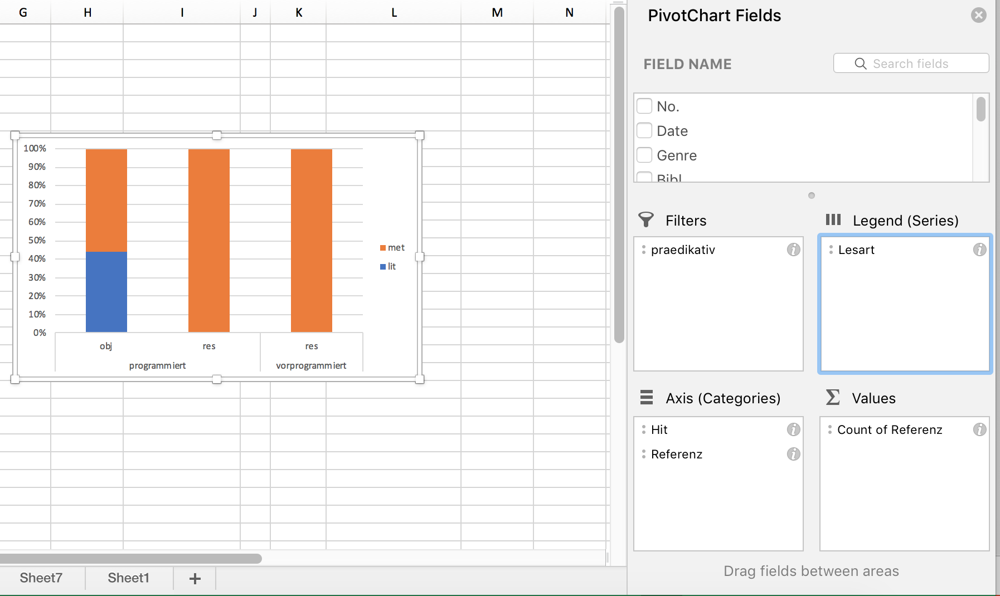

# Von der Konkordanz zur Analyse

Nun haben wir die Konkordanz erfolgreich in ein Tabellenkalkulationsprogramm importiert. Hier können wir beliebig viele weitere Spalten hinzufügen. Das können wir nutzen, um die exportierten Belege mit **Annotationen** zu versehen.

## Annotation

Versieht man Daten mit zusätzlichen Informationen, so nennt man diesen Prozess Annotation. In der Korpuslinguistik stellt die Annotation einen ganz wesentlichen Schritt dar, der gewissermaßen die Brücke schlägt von der qualitativ-philologischen Analyse einzelner Belege zur quantitativen Auswertung.

Wir nutzen im Folgenden die Annotation, um unsere Daten in Kategorien zu unterteilen, die für unsere Fragestellung sinnvoll sind. Dafür müssen wir uns zunächst darüber im Klaren sein, was wir von unseren Daten überhaupt wissen wollen, d.h. wir müssen unsere eingangs genannte Fragestellung operationalisieren.

Zur Erinnerung: Unsere Fragestellung lautet, ob bei prädikativem Gebrauch *vorprogrammiert* gegenüber *programmiert* bevorzugt wird, wenn es sich um einen metaphorischen Kontext handelt.

Konkret bedeutet das, dass wir für jeden Datenpunkt folgende Fragen beantworten müssen:

1. Handelt es sich um eine prädikative Verwendung? – Schon ein kurzer Blick auf die Daten zeigt, dass sich notwendigerweise einige **Fehltreffer** eingeschlichen haben: Häufig finden sich z.B. Passivkonstruktionen wie *Es gibt jedoch medizinische Gründe, aus denen eine Geburt eingeleitet oder sogar programmiert werden muß*. Uns interessieren aber nur Fälle, in denen das Partizip selbst das Prädikat bildet, also z.B. *Der Computer ist programmiert* und *Die Katastrophe war vorprogrammiert*.

2. Handelt es sich um eine metaphorische Verwendung? – Während beispielsweise Computer oder Roboter im wörtlichen Sinne programmiert werden, bezieht sich der Begriff bei Krisen und Katastrophen darauf, dass Voraussetzungen geschaffen wurden, die unausweichlich den thematisierten unschönen Ausgang zur Folge haben. Es liegt also ein metaphorischer Gebrauch vor, bei der Aspekte der Quelldomäne "Technik" auf eine abstraktere Zieldomäne übertragen werden. 

In den nächsten Abschnitten wollen wir uns beiden Fragen etwas genauer zuwenden.

### Annotation prädikativ vs. nicht-prädikativ

Wenn wir Daten annotieren, besteht eine wesentliche Herausforderung immer in der **Operationalisierung** konkreter Fragestellungen. In vielen Fällen ist es so, dass wir die Frage, die uns interessiert, auf den ersten Blick für jeden Datenpunkt klar beantworten zu können glauben. Bei genauerem Hinsehen ergeben sich dann aber doch einige Zweifelsfälle. So ist es auch hier: Um die Frage operationalisieren zu können, muss man zunächst einmal die Entscheidung treffen, ob man eine Struktur wie *Der Computer ist programmiert* als Zustandspassiv mit *sein* als Hilfsverb (analog zum Vorgangspassiv mit *werden* als Hilfsverb) oder als Konstruktion aus der Kopula *sein* und dem Partizip II *programmiert* interpretiert. Wir entscheiden uns hier für Letzteres. Jedoch zeigt dieses Beispiel: Wie wir Daten interpretieren, hängt oft genug von unserem theoretischen Zugang ab. Das ist nicht weiter schlimm, sondern liegt in der Natur der Sache – Wissenschaft kann nie ganz frei von Theorie und nie ganz frei von Interpretation sein. Wichtig ist, dass die Entscheidung, die wir treffen, sich gut begründen lässt und konsequent durchgehalten wird.

Wie setzen wir die Annotation nun in unserer Tabelle um? Auch hier zeige ich wieder Wege für [Excel][Umsetzung in Excel] und [Calc][Umsetzung in Calc]. Gerade die unten skizzierte Möglichkeit, Daten als "Tabelle" zu formatieren, finde ich persönlich an Excel sehr hilfreich, weshalb ich Excel i.d.R. bevorzuge. Allerdings halte ich es auch für wichtig, sich in der Wissenschaft nicht von proprietärer Software oder proprietären Datenformaten abhängig zu machen, und nicht jede Uni hat eine Office-Lizenz – deshalb zeige ich auch den Weg mit der freien Alternative auf.

#### Umsetzung in Excel

Zunächst empfiehlt es sich, die Tabelle im Excel-Standardformat .xlsx zu speichern.

Excel bietet die schöne Möglichkeit, Daten als Tabelle zu formatieren. Das ist über den Reiter Einfügen > Tabelle möglich, wie in \@ref(fig:excelastable) gezeigt. In der Regel erkennt Excel automatisch die Dimensionen der Tabelle, sodass Sie nur noch anklicken müssen, dass die Tabelle Überschriften hat, und dann auf "OK" klicken können, und schon sind alle Zellen schön formatiert, und vor allem kann man über die kleinen Pfeilsymbole oben die einzelnen Spalten nach bestimmten Werten filtern, was sich im weiteren Verlauf der Arbeit noch als nützlich erweisen kann. (Letzteres erreicht man auch über Daten > Filter, aber mit der Tabellen-Option wird das Ganze optisch noch ein bisschen hübscher, und vor allem muss man keinen neuen Filter setzen, wenn man eine neue Spalte hinzufügt.)

Um die Belege im Kontext besser lesen zu können, empfiehlt es sich, zunächst ein paar Feinjustierungen in der Formatierung vorzunehmen. So können wir Spalten, die wir derzeit nicht benötigen (z.B. alle Spalten mit Metadaten), zunächst ausblenden. (Nicht löschen! Im Zweifelsfall nie Spalten löschen, wer weiß, wozu man sie später noch benötigt...) Außerdem kann es hilfreich sein, den Text in der Spalte mit dem linken Kontext rechtsbündig zu formatieren und die Breite der einzelnen Spalten so anzupassen, dass man den Beleg und ausreichend viel Kontext lesen kann und doch alle derzeit wichtigen Spalten gleichzeitig auf dem Bildschirm zu sehen sind. Wenn Sie die HTML-Version dieses Dokuments lesen, sehen Sie im weiteren Verlauf von Screencast \@ref(fig:excelastable) (nach der Formatierung der Daten als Tabelle), wie eine solche Feinjustierung aussehen kann.

(\#fig:excelastable)Formatierung als Tabelle und Hinzufügen einer Annotationsspalte *praedikativ*

‣ **Zeilenumbruch innerhalb von Tabellenspalten**

In einigen Fällen, in denen man sehr viel Text im linken und rechten Kontext hat und in denen man für die Annotation auch auf den weiteren Kontext angewiesen ist, kann es sinnvoll sein, die Tabelle so zu formatieren, dass innerhalb der Zelle ein Zeilenumbruch vorgenommen wird. Standardmäßig ist die Tabelle so formatiert, dass jede Zelle nur eine Zeile hat, und was über die Zelle hinausgeht, wird nicht angezeigt (ist aber trotzdem noch in den Daten vorhanden). Wenn man durch Klick auf den Buchstaben oberhalb der Spalte, die man formatieren möchte, zunächst die ganze Spalte markiert, kann man unter Rechtsklick > Zellen formatieren im Tab "Alignment" ("Ausrichtung") die Option "Wrap text" (Zeilenumbruch) aktivieren.

(\#fig:excelwrap)Zeilenumbruch innerhalb von Zellen einschalten

Als nächstes fügen wir eine neue Spalte rechts von der letzten existierenden Spalte hinzu, der wir die Überschrift "praedikativ" geben. (Wir könnten auch problemlos den Umlaut verwenden, aber ich neige dazu, aus Vorsicht alle Sonderzeichen, die Probleme bereiten könnten, wegzulassen.) Hier tragen wir nun für jeden Datenpunkt ein, ob es sich um eine prädikative Verwendung handelt oder nicht. Ich verwende hierfür gern die Werte "y" und "n", weil sie schön kurz sind. j/n oder ja/nein gehen natürlich auch. 

Um Zeit zu sparen, kann man auch nur einen der beiden Werte annotieren und dann die leeren Zellen einfach auffüllen, wie in \@ref(fig:excelbulkchange) gezeigt: Hier sind die "y"-Werte schon annotiert, alle anderen Zeilen sind leer. Nun filtert man erst die "praedikativ"-Spalte so, dass nur noch die leeren Zellen zu sehen sind, indem man die Zellen mit dem Wert "y" abwählt. Dann markiert man die Spalte "praedikativ" von der ersten bis zur letzten Zeile (die Überschrift wird nicht mitmarkiert). Gibt man nun "n" ein (noch nicht Enter drücken!!), so erscheint der Wert zunächst in der ersten Zeile. Drückt man nun statt der Eingabetaste Strg+Enter (bzw. bei Mac Cmd+Enter), so wird der in der ersten Zeile eingegebene Wert auf alle folgenden Zellen übertragen.

(\#fig:excelbulkchange)Eine Tabellenspalte wird so gefiltert, dass nur noch die leeren Zellen zu sehen sind, und allen leeren Zellen wird mit Strg/Cmd+Enter derselbe Wert zugewiesen.

Wenn wir nun den Filter herausnehmen, sehen wir, dass nun alle vorher leeren Zeilen ein "n" haben, während alle Zeilen mit "y" unverändert geblieben sind.

#### Umsetzung in Calc

In Calc empfiehlt es sich, zunächst einmal die Spaltenbreite anzupassen und nicht benötigte Spalten auszublenden (nicht löschen – im Zweifelsfall niemals Spalten oder Zeilen löschen, wer weiß, wofür man sie noch benötigt!). Ich selbst gehe in der Regel so vor, dass ich alle Spalten bis auf diejenigen mit den eigentlichen Belegen (linker Kontext, Treffer, rechter Kontext) ausblende und die Spalte mit dem linken Kontext so formatiere, dass der Text rechtsbündig angezeigt wird. So kann ich bequem den Beleg vom linken Kontext über den Treffer bis zum Keyword lesen. In der HTML-Version dieses Tutorials sehen Sie das in Screencast \@ref(fig:calcformat).

(\#fig:calcformat)Formatierung der Tabelle in Calc und Setzen eines Filters

Wenn Sie die Formatierungsoptionen für zukünftige Sitzungen speichern möchten, müssen Sie die Datei in einem anderen Format, z.B. im Calc-Standardformat .ods, speichern. Prinzipiell können Sie aber auch einfach in der CSV-Datei weiterarbeiten. Wenn Sie die Datei zwischenspeichern, werden dann eventuell neu eingetragene Daten gespeichert, nicht aber die Formatierung, die Sie dann, wenn Sie die Datei schließen und wieder öffnen, noch einmal neu einstellen müssen.

Wir können nun eine neue Spalte rechts von der letzten existierenden Spalte hinzufügen, der wir die Überschrift "praedikativ" geben. (Wir könnten auch problemlos den Umlaut verwenden, aber ich neige dazu, aus Vorsicht alle Sonderzeichen, die Probleme bereiten könnten, wegzulassen.) Hier tragen wir nun für jeden Datenpunkt ein, ob es sich um eine prädikative Verwendung handelt oder nicht. Ich verwende hierfür gern die Werte "y" und "n", weil sie schön kurz sind. j/n oder ja/nein gehen natürlich auch. 

Um Zeit zu sparen, kann man auch nur einen der beiden Werte annotieren und dann die leeren Zellen einfach auffüllen. Dafür müssen wir zunächst einen Filter setzen, wie in \@ref(fig:calcformat) gezeigt. Über diesen Filter können wir jetzt die leeren Zellen ausblenden, Hier sind die "y"-Werte schon annotiert, alle anderen Zeilen sind leer. Nun filtert man erst die "praedikativ"-Spalte so, dass nur noch die leeren Zellen zu sehen sind, indem man die Zellen mit dem Wert "y" abwählt. Dann markiert man die Spalte "praedikativ" von der ersten bis zur letzten Zeile (die Überschrift wird nicht mitmarkiert). Gibt man nun "n" ein (noch nicht Enter drücken!!), so erscheint der Wert zunächst in der ersten Zeile. Drückt man nun statt der Eingabetaste Alt+Enter, so wird der in der ersten Zeile eingegebene Wert auf alle folgenden Zellen übertragen.

(\#fig:calcbulkchange)Eine Tabellenspalte wird so gefiltert, dass nur noch die leeren Zellen zu sehen sind, und allen leeren Zellen wird mit Alt+Enter derselbe Wert zugewiesen.

Damit ist die Spalte nun vollständig ausgefüllt.

### Annotation metaphorisch vs. nicht-metaphorisch

Für die weitere Annotation können wir die nicht-prädikativen Fälle außer Acht lassen. Hier können wir auf die oben erwähnten Filteroptionen zurückgreifen, um die nicht-prädikativen Fälle herauszufiltern.

Nun gilt es, zu entscheiden, wann *programmiert* und *vorprogrammiert* metaphorisch verwendet werden und wann nicht. Auch das ist auf den ersten Blick denkbar einfach: Einen Computer oder einen Roboter kann man im wörtlichen Sinn programmieren, eine Katastrophe eher nicht – allenfalls indirekt, indem man z.B. Maschinen programmiert, die dann die Weltherrschaft übernehmen, siehe so ziemlich jede Dystopie von "Terminator" bis "Matrix". Aber genau dieses indirekte Programmieren bringt uns schon zu möglichen Zweifelsfällen: Was ist, wenn sich ein Satz wie *Die Konfrontation ist programmiert* auf einen Roboter bezieht?

Solche Zweifelsfälle ergeben sich gerade bei einer im weitesten Sinne semantischen Annotation immer. Daher ist es wichtig, klare **Annotationsrichtlinien** zu formulieren, in der alle Annotationsentscheidungen genau dokumentiert sind. Oftmals entwickeln sich diese Richtlinien im Zuge der Annotation selbst, weil man über Daten stolpert, die man so zunächst nicht erwartet hätte. (Was übrigens ein gutes Argument dafür ist, sich bei der Analyse von Sprache nicht allein auf die eigene Intuition zu verlassen, sondern Korpusdaten zu Rate zu ziehen!)

Wenn wir nun wörtlichen und metaphorischen Gebrauch annotieren wollen, könnten unsere Annotationsrichtlinien zunächst ganz einfach so aussehen:

1. Geht aus dem Kontext eindeutig hervor, dass ein Computer bzw. eine Maschine programmiert worden ist, liegt wörtlicher Gebrauch vor.

2. Geht aus dem Kontext eindeutig hervor, dass sich das Verb auf eine andere Entität bezieht, liegt metaphorischer Gebrauch vor.

3. Geht aus dem Kontext nicht hervor, worauf genau sich "(vor)programmiert" ist, wird der Beleg als unklar gewertet.

Auf diesen Kriterien aufbauend können wir nun eine neue Spalte in unserer Tabelle eröffnen, die wir z.B. "Lesart" nennen können. Hier vergeben wir die Werte "lit" (literal/wörtlich), "met" (metaphorisch) und "unklar". Gerne können Sie es einmal versuchen und Ihre Ergebnisse dann mit meinen (in den .xlsx- und .ods-Dateien im <a href="https://github.com/empirical-linguistics/korpus-schnelleinstieg/tree/master/data" target="_blank">"data"-Ordner</a>) vergleichen.

Der große Vorteil der oben formulierten Annotationskriterien ist, dass sie sich in den meisten Fällen relativ zweifelsfrei anwenden lassen. Jedoch zeigt sich beim Durchgehen der konkreten Belege, dass die binäre Unterscheidung "wörtlich/metaphorisch" dem Gebrauch von *(vor)programmiert* möglicherweise nicht ganz gerecht wird. So fallen die folgenden Beispiele alle in die "metaphorische" Kategorie:

(1) Der moderne, verbildete Mensch ist nach festen Rhythmen auf das eingeschaltete Gerät programmiert und genußbereit.

(2) Unsere Gene sind auf Lug und Trug programmiert

(3) da ist Streit mit den Arbeitgebern programmiert.

Die ersten beiden Beispiele bedienen sich der verbreiteten "Computermetapher", konzeptualisieren also den menschlichen Geist bzw. die menschlichen Gene als "Computer". Das ist im letzten Beispiel nicht der Fall: Hier geht es nicht um das Objekt des Programmiervorgangs, sondern um das Resultat. Diese Verwendung ist in gewisser Weise also abstrakter. Das ist allerdings eine Dimension, die grundsätzlich von der Dimension der wörtlichen vs. metaphorischen Verwendung unabhängig ist: Angenommen, ich baue mir, wie es verrückte Wissenschaftler in Filmen gerne tun, eine Frühstücksmaschine, die so programmiert ist, dass sie mir morgens um 7 ein Spiegelei brät, und sage: "Das Spiegelei ist für 7 programmiert", dann ist das zwar eine resultatsbezogene, aber keine metaphorische (sondern eher eine metonymische) Verwendung.

Es wäre daher sinnvoll, auch diese Dimension noch zu kodieren.^[Der Vollständigkeit halber sei darauf hingewiesen, dass es sich dabei um eine Post-hoc-Analyse handelt. Wenn Sie sich ein wenig in die Wissenschaftsphilosophie einlesen, werden Sie merken, dass so etwas nicht unumstritten ist: Oft gilt es als Ideal, sämtliche Hypothesen und Analysemethoden im Voraus festzulegen, bevor man sich den Daten selbst zuwendet. *Post hoc* aufgestellte Hypothesen müsste man dann eigentlich anhand von neuen Daten überprüfen. De facto ist es freilich oft so, dass für so ein rigides Vorgehen Zeit und Ressourcen fehlen. Gerade bei einer Seminararbeit können Sie diesen Punkt natürlich in aller Regel getrost ignorieren.] Deshalb fügen wir noch eine weitere Annotationsspalte hinzu, die wir "Referenz" nennen: Referiert der fragliche Satz auf das, was programmiert wird, oder auf das Resultat der Programmierung?

Auch hierfür formulieren wir wieder Annotationskriterien:

1. Wenn aus dem Kontext eindeutig hervorgeht, dass sich der Satz auf das Objekt des Programmiervorgangs bezieht (*der Computer ist programmiert* 'jemand (Subj.) hat den Computer (Obj.) programmiert'), wird der Beleg mit "obj" annotiert.

2. Wenn aus dem Kontext eindeutig hervorgeht, dass sich der Satz auf das Resultat des (ggf. stark metaphorischen) Programmiervorgangs bezieht (*das Spiegelei ist programmiert* 'jemand hat die Frühstücksmaschine so programmiert, dass sie ein Spiegelei (Resultat) macht' oder *die Katastrophe ist programmiert* 'es wurden Entscheidungen getroffen, die zwangsläufig in eine Katastrophe (Resultat) führen'), so wird der Beleg mit "res" annotiert.

3. Lässt sich keine eindeutige Entscheidung treffen, bekommt der Beleg den Wert "unklar".

In den .xlsx- und .odt-Dateien im <a href="https://github.com/empirical-linguistics/korpus-schnelleinstieg/tree/master/data" target="_blank">"data"-Ordner</a> habe ich das in der Spalte "Referenz" umgesetzt. Auch hier können Sie gern die Probe aufs Exempel machen und überprüfen, ob Ihre Annotationen mit meinen übereinstimmen. Wahrscheinlich werden Sie im einen oder anderen Fall andere Entscheidungen treffen als ich – das ist ganz normal und auch der Grund dafür, warum man idealerweise mindestens zwei Personen unabhängig voneinander annotieren lassen und dann die Annotationen vergleichen sollte. (De facto ist das natürlich gerade bei einer Seminararbeit häufig nicht möglich).

## Auswertung und Visualisierung

Nachdem wir nun die Daten annotiert haben, können wir unsere Annotationen quantitativ auswerten. Auch hier zeige ich wieder die einzelnen Wege für Excel und Calc auf.

### Auswertung und Visualisierung in Excel

Ideal für die Auswertung und Visualisierung in Excel ist die PivotTable-Funktion. Manches an dieser Funktion ist zunächst ein wenig gewöhnungsbedürftig, aber nach kurzer Eingewöhnungszeit ist sie doch halbwegs logisch und intuitiv. 

Stellen Sie zunächst sicher, dass eine Zelle innerhalb der Tabelle angewählt ist (z.B. die Zelle ganz oben links). Jetzt klicken wir im Reiter "Einfügen" auf "PivotTable". Nun öffnet sich ein Fenster, in dem wir gefragt werden, welche Zellen Teil der PivotTable werden sollen (hier sollte Excel bereits automatisch erkannt haben, dass wir die ganze Tabelle einbeziehen wollen, sodass wir nichts mehr ändern müssen) und ob die Tabelle auf dem aktuellen oder einem neuen Arbeitsblatt erstellt werden soll – es empfiehlt sich, sie auf einem neuen Arbeitsblatt zu erstellen, was auch die Default-Option ist. Also können wir einfach OK klicken. In der HTML-Version dieses Tutorials können Sie die einzelnen Schritte in Screencast \@ref(fig:excelpivot) nachverfolgen.

(\#fig:excelpivot)Erstellen einer Pivot-Tabelle in Excel.

Nun öffnet sich ein neues Arbeitsblatt (mit den Reitern unten können Sie zwischen den Arbeitsblättern navigieren und ihnen ggf. auch aussagekräftigere Namen geben). Wir sehen ein dreigeteiltes Fenster. Im Arbeitsblatt selbst finden wir ein etwas kryptisch aussehendes, noch weitgehend leeres Feld mit einer Beschriftung wie "PivotTable1" o.ä. Das ist quasi der Platzhalter für die noch zu erstellende Tabelle. Rechts sehen wir oben eine Aufstellung der Namen der Tabellenspalten, unten sehen wir ein wiederum viergeteiltes Fenster. In die vier Felder in diesem Fenster können wir nun ausgewählte Spaltennamen aus dem Fenster oben rechts ziehen. Probieren Sie doch einmal, die Spalte "Hit" in das Feld "Zeilen" zu ziehen. Jetzt sehen Sie in der Pivot-Tabelle die beiden Zeilen "programmiert" und "vorprogrammiert". Höchstwahrscheinlich ist "Hit" auch automatisch im Fenster "Werte" unten rechts aufgetaucht. Deshalb wird Ihnen in der Pivot-Tabelle auch die Häufigkeit der beiden Varianten angezeigt, wie in \@ref(fig:excelpivotsimple).

(\#fig:excelpivotsimple)Eine Pivot-Tabelle in Excel.

Die Logik ist also ganz einfach: Was im Feld "Spalten" steht, taucht in den Spalten der Tabelle auf, was im Feld "Zeilen" steht, taucht in den Zeilen auf, und was im Feld "Werte" steht, das wird ausgezählt^[bzw. bei numerischen Werten aufsummiert; hier muss man ggf. aufpassen, dass die richtige Operation gewählt ist. Durch Klick auf das kleine Info-Symbol in den Feldern kann man das bei Bedarf anpassen]. Mit Hilfe des Felds "Filter" kann man die Daten bei Bedarf filtern.

In unserem Beispiel wollen wir genau das tun: Wir wollen ja nur die prädikativ gebrauchten Instanzen von *(vor)programmiert* berücksichtigen. Leeren wir die beiden Felder zunächst wieder, indem wir "Hit" aus dem jeweiligen Feld in das Fenster rechts oben ziehen (Fig. \@ref(fig:countofhit)). 

(\#fig:countofhit)Entfernen einer Spalte aus dem "Werte"-Feld.

Dann ziehen wir die Spalte "prädikativ" in das Feld "Filter". Jetzt können wir im Fenster links die nicht-prädikativen Daten herausfiltern (s. Fig. \@ref(fig:praedikativfilter)).

(\#fig:praedikativfilter)Herausfiltern der Daten mit "praedikativ=n".

Nun wollen wir eine tabellarische Übersicht über die Lesarten und die Referenz (Objekt vs. Resultat) getrennt nach den beiden Varianten "programmiert" und "vorprogrammiert" bekommen. Führen wir uns noch einmal vor Augen, was die dafür relevanten Tabellenspalten sind:

- Die Spalte "Lesart" enthält die Lesarten.
- Die Spalte "Referenz" enthält die Information darüber, ob der jeweilige Beleg auf das Objekt des Programmiervorgangs oder dessen Resultat referiert.
- Die Spalte "Hit" enthält die Variante des Treffers.

Zur Auswertung müssen wir die drei Spalten nun sinnvoll auf die "Zeilen"- und "Spalten"-Felder verteilen und zudem angeben, was ausgezählt werden soll. Hier gibt es mehrere Möglichkeiten; eine davon ist in \@ref(fig:excelfilter) dargestellt: In den Spalten werden die Daten nach Variante ("Hit") ausgewertet, in den Zeilen zum einen nach Lesart, zum anderen nach Referenz. Ausgezählt wird die Spalte "Lesart" – genauso gut könnten wir aber auch die Spalte "Referenz" auszählen, die Ergebnisse wären die gleichen, da ja beide Variablen in der Tabelle berücksichtigt sind.

(\#fig:excelfilter)Tabellarische Auswertung der Korpusdaten mit Hilfe der PivotTable-Funktion.

Schon auf den ersten Blick sehen wir eine ungleiche Verteilung der Daten auf die beiden Varianten: *vorprogrammiert* wird in unseren Daten ausschließlich in metaphorischen Kontexten und ausschließlich für Resultate gebraucht. Bei *programmiert* ist der Gebrauch vielfältiger, wenngleich auch hier eine Präferenz für eben diese Merkmalskombination (metaphorischer Kontext/Resultat) deutlich wird.

Quasi als Sahnehäubchen können wir diese Verteilung auch visualisieren, beispielsweise mit einem Balkendiagramm.^[Vgl. jedoch z.B. <a href="https://barbarplots.github.io/" target="_blank">diese Seite</a> zu Problemen, die Balkendiagramme u.U. mit sich bringen.] Das geht, indem wir die relevanten Zellen in der PivotTable markieren (also alles, was nicht die Gesamtsumme anzeigt) und dann in "Einfügen" eine passende Visualisierungsoption auswählen. \@ref(fig:excelvisualize) zeigt eine Möglichkeit, das umzusetzen:

(\#fig:excelvisualize)Erstellen eines Balkendiagramms aus einer Pivot-Tabelle in Excel.

Welche Daten auf der x- und auf der y-Achse dargestellt und welche innerhalb der Balken farblich kodiert werden, hängt davon ab, welche Daten in der Pivot-Tabelle in den Zeilen und in den Spalten stehen. Gegebenenfalls kann man hier noch ein paar Änderungen vornehmen, um die Darstellung sinnvoller zu gestalten. So entsteht in Fig. \@ref(fig:excelvisualize) ein Diagramm, bei dem die Variante (*programmiert* vs. *vorprogrammiert*) farblich kodiert wird. Das ist nicht unbedingt sinnvoll, weil wir ja wissen wollen, wie sich die Verteilung der unterschiedlichen Lesarten zwischen den beiden Varianten unterscheidet. Man kann die visuelle Darstellung auch in dem "Pivot Chart Fields"-Feld ändern, das sich bei der Erstellung des Balkendiagramms geöffnet haben dürfte (\@ref(fig:pivotchartfields)).

(\#fig:pivotchartfields)Der Dialog "Pivot Chart Fields" (rechts) erlaubt es, anzupassen, was wo in der Grafik dargestellt wird.

Und noch etwas Feinjustierung: Damit die Grafik nicht so asymmetrisch aussieht wie Fig. \@ref(fig:asymmetric), werden (im ersten Schritt in \@ref(fig:excelvisualize)) zunächst die Feldeinstellungen so verändert, dass auch Felder mit Null-Werten angezeigt werden. Anschließend wird ein Balkendiagramm ausgewählt, das den prozentualen Anteil der jeweiligen Variante darstellt. Durch Rechtsklick auf die Balken kann man außerdem noch "Data Labels" hinzufügen, d.h. die absoluten Werte in den Balken darstellen lassen. Das ist empfehlenswert, weil so die Leserin oder der Leser schnell einen Eindruck gewinnen kann, wie groß die Datenbasis ist, auf der die Darstellung basiert – denn es macht ja schon einen gewichtigen Unterschied, ob eine Verteilung wie, sagen wir 10% : 90% auf zehn, auf hundert oder auf tausend Datenpunkten basiert! Die "Data Labels" kann man hinzufügen durch Rechtsklick auf die Balken und Klick auf den Punkt "Show data labels". 
 

(\#fig:asymmetric)Balkendiagramm, in dem nicht belegte Variablenausprägungen ausgelassen werden.

### Auswertung und Visualisierung in Calc

Auch in Calc gibt es eine PivotTable-Funktion, die sich im Dropdown-Menü "Data" findet. Mit Hilfe von PivotTable > Erstellen gelangt man in ein Auswahlmenü, in dem rechts die einzelnen Spaltennamen als "available fields" zu sehen sind. Links sehen wir drei rechteckige Felder: eins für Zeilen, eins für Spalten und eins für Werte (das Letztere trägt die nicht ganz so aussagekräftige Überschrift "Data fields"). Aus der Auflistung rechts können wir nun die Variablen, die wir in den Spalten sehen wollen, ins "Spalten"-Feld ziehen, diejenigen, die wir in den Zeilen sehen wollen, ins "Zeilen"-Feld und schließlich diejenigen, die Calc für uns auszählen soll, ins "Data fields"-Feld. 

(\#fig:calcpivot)Erstellen einer Pivot-Tabelle in Calc.

Beim Erstellen der Pivot-Tabelle können wir in den ausklappbaren Optionen auch auswählen, dass wir keine Zeilen- und Spaltensummen sehen wollen (die brauchen wir nicht, zumal sie dann ggf. auch in den auf der Tabelle basierenden Visualisierungen dargestellt werden und da nur verwirren), aber dass wir Filter setzen möchten. Wenn wir nun auf OK klicken, sehen wir die Pivot-Tabelle, oberhalb derer sich ein "Filter"-Feld befindet, auf das wir doppelklicken können, um durch Auswählen des Attribut-Wert-Paars "praedikativ = y" die Tabelle so zu filtern, dass nur die prädikativen Belege angezeigt werden.

Mit Hilfe der Tabelle können wir nun die Verteilung auch visualisiern, z.B. mit einem Balkendiagramm.^[Vgl. jedoch den Caveat in der vorherigen Fußnote.] Das ist über Insert > Chart möglich. Hier haben wir die Wahl zwischen mehreren Optionen und wählen ein sog. gestapeltes Balkendiagramm, das die prozentuale Verteilung anzeigt. Die einzelnen Schritte sind in \@ref(fig:calcchart) dargestellt. 

(\#fig:calcchart)Erstellen einer Pivot-Tabelle in Calc.

Im Gegensatz zu Excel bietet Calc derzeit leider keine Möglichkeit, sich in Pivot-Tabellen Nullwerte anzeigen zu lassen. Das heißt, wenn wir im Balkendiagramm die Kategorien "lit" und "unklar" auch für *vorpgrammiert* sehen wollen, um das Diagramm symmetrisch zu halten, müssen wir sie irgendwie manuell einfügen, weil für *vorprogrammiert* ja nur metaphorische Lesarten belegt sind. Einen sehr uneleganten, aber funktionierenden Workaround zeigt \@ref(fig:calcchart2): Weil wir an der Pivot-Tabelle selbst nichts verändern können, copy&pasten wir sie an eine andere Stelle im Arbeitsblatt und ergänzen die fehlenden Kategorien manuell. Das ist zwar, wie es ein User in einem Frage-und-Antwort-Forum zu diesem Thema sehr schön formuliert hat, weniger eine Lösung als eine Kapitulation, aber zumindest für diesen recht überschaubaren Datensatz funktioniert der Ansatz.

(\#fig:calcchart2)Erstellen einer Pivot-Tabelle mit Nullwerten in Calc (Workaround).

Zuletzt wollen wir die Balken noch mit Labels versehen, d.h. wir wollen die absoluten Werte auf den Balken anzeigen. Auch hier kann Excel etwas mehr als Calc, und wir müssen etwas tricksen, um die absoluten Werte anzeigen zu lassen. Mit Rechtsklick auf einen der Balken > Insert Data Labels können wir zunächst die Labels anzeigen lassen, sehen aber erstens keine absoluten Werte, sondern Prozentwerte, und zweitens absurde Prozentwerte, weil Calc offenbar die Zahlen in der Tabelle für relative Werte hält. Mit Doppelklick auf eines der Labels können wir jedoch das Zahlenformat ändern und angeben, dass wir die Labels einfach als "Text" angezeigt bekommen wollen – also einfach das, was in der Pivot-Tabelle selbst steht (s. Fig. \@ref(fig:calcdatalabels)).

(\#fig:calcdatalabels)Einfügen von Data labels in Calc.

